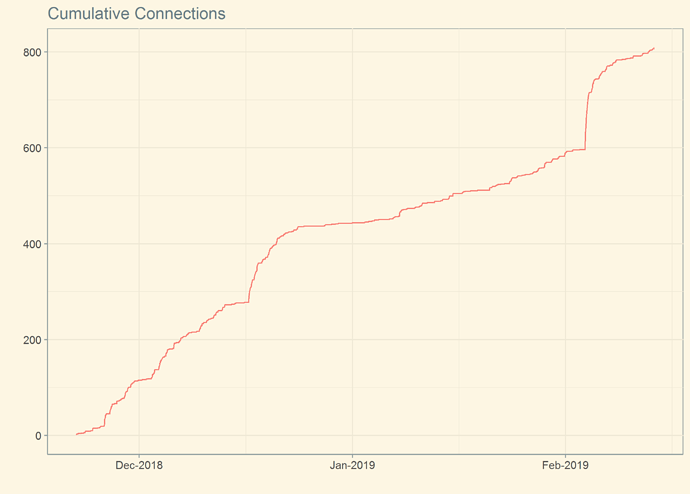

## Pasture Potential Tool for improving dairy farm profitability and environmental impact

**Author**: Simon Woodward

**Affiliation**: DairyNZ Ltd, New Zealand

**The Pasture Potential Tool**

Thank you for the opportunity to enter our Pasture Potential Tool in the _2019 RStudio Shiny Contest!_

* [Link to the Pasture Potential Tool on Shinyapps.io](https://dairynz.shinyapps.io/pasture19_comp/)
* [Link to the Pasture Potential Tool on RStudio Cloud](https://rstudio.cloud/project/215333)
* [Link to the Pasture Potential Tool as deployed on _www.dairynz.co.nz_](https://www.dairynz.co.nz/feed/pasture-management/assessing-farm-performance/pasture-and-crop-eaten/pasture-potential-tool/)

**The purpose of the tool**

The Pasture Potential Tool was developed to motivate farmers to increase the proportion of pasture (including crops grown on farm) in their cows' diet. Purchasing feed from off-farm has been shown to be less profitable than feeding pasture alone, and also increases nutrient losses to the environment. However farmers are often not aware that, by improving pasture management or fertilisation, they could grow more pasture on their farm. 

The tool allows a farmer to select similar farms from the farm database [DairyBase](https://www.dairynz.co.nz/business/dairybase/), and compare pasture and crop grown on these farms for a given year (expressed as tonnes of dry matter, tDM). 

**How it works**

Data selection is interactive, and uses a zoomable Google Maps `leaflet` (including a search bar) to pinpoint the user's location. The density of available data is shown using an overlaid heatmap. 

```
leaflet(spgons, options=leafletOptions(minZoom=v$minzoom, maxZoom=v$maxzoom)) %>%
  setView(v$long, v$lat, zoom=v$zoom)  %>%
  addTiles() %>% # default map
  addPolygons(data=spgons, color=spgon_cols, weight=0, options=pathOptions(clickable=FALSE)) %>%
  addMarkers(my$long, my$lat, "layer1", options=pathOptions(clickable=FALSE)) %>%
  addCircles(my$long, my$lat, layerId=as.character(windows), radius=windows*1000, 
             color=window_cols, weight=4, fill=NA, options=pathOptions(clickable=FALSE))
```
A series of linked `selectInput` boxes is used to subset the data by year, altitude, soil order and annual fertiliser. [Refreshing the cascade of reactive inputs in response to user selections proved tricky.](https://stackoverflow.com/questions/49418069/updating-shiny-ui-element-doesnt-invalidate-its-associated-input-value)

Pasture and crop grown for farms in a 20, 40 and 60 km radius is then plotted as a faceted histogram using `ggplot`. "Pasture Potential" is defined as the 90th percentile of the data. This is estimated using `quantreg` and  superimposed on the histogram (along with the bootstrap 95% confidence interval of the estimate).

```
# calculate quantile
qr1 <- quantreg::rq(formula=pasture_eaten ~ 1, tau=0.9, data=data_window) # linear quantile regression
se_method <- "boot" # how confidence intervals are calculated, some methods more robust
yqr1<- predict(qr1, tibble(east=my$east, north=my$north), interval="confidence", level=0.95, se=se_method)
q90 <- quantile(data_window$pasture_eaten, 0.9, type=1) # also calc simple q90
```

**Usage so far**

Usage metrics are obtained with `rsconnect` and show that the tool has been accessed more than 800 times in since it went live in November 2018. There are approximately 10000 dairy farms in New Zealand.

```
# http://docs.rstudio.com/shinyapps.io/metrics.html#ApplicationMetrics
df <- rsconnect::showMetrics("container_status",
                             c("connect_count", 
                               "connect_procs"),
                             appName="pasture_embed",
                             server="shinyapps.io",
                             from="12w",
                             interval="1m"
                             ) 
```



**Technical Notes**

The app file is `pasture_embed27.r`.

The app must be deployed along with authentication files for the Google Maps API, and for Dropbox, where the data is located. The Google key is stored in a small text file called `google.api`. The Dropbox authentication file is called `token.rds`, and is generated using the following code which is included in the app, but only works locally.

```
  # google auth 
  googlekey <- readLines("google.api") # text file with the API key
  
  # dropbox auth
  if (file.exists("token.rds")){
    token <- readRDS("token.rds")
  } else {
    token <- drop_auth() # launches a login page
    saveRDS(token, "token.rds") # need to do this locally then deploy this file to shiny
  }
```

The data file for the app is called `joined_small.rds` and is stored in the Dropbox folder `/pasture_potential_data_files/` in the Dropbox account username simonjrwoodward@gmail.com password ******. 

This data file is updated as follows:

  1. open the update_data R project, which is in an adjacent directory to the pasture_potential R project
  2. save your new DairyBase data file as dairybasesomething.csv in the update_data directory (remove empty rows and columns)
  3. in the script read_dairybase.r add the new data file to the code (non trivial) 
  4. source read_dairybase.r to create the dairybase.rds file
  5. save a copy of read_dairybase.r as read_dairybase_YYYYMMDD.r using today's date
  6. source join_databases.r to create the joined.rds and joined_small.rds files (this takes a long time)
  7. there is a report in join_databases_report.txt
  8. copy the joined_small.rds file to Dropbox (currently C:\Users\WoodwardS\Dropbox\pasture_potential_data_files)
